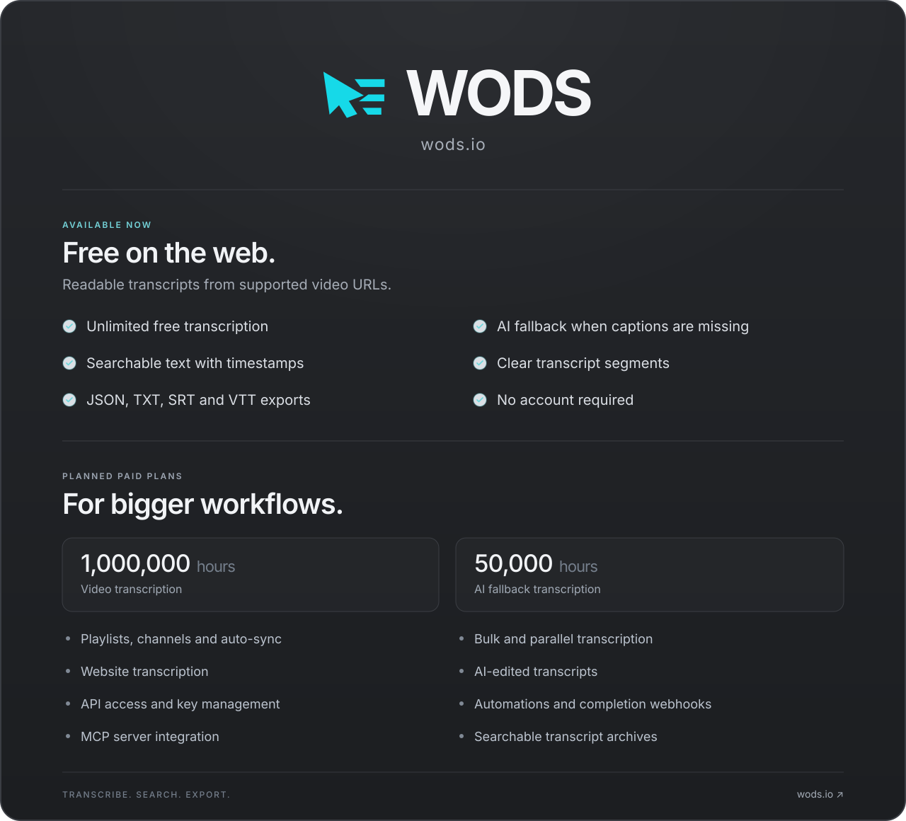

  

  <a href="https://wods.io">wods.io</a>&nbsp; · &nbsp;<a href="https://wods.io/docs">Documentation</a>&nbsp; · &nbsp;<a href="https://wods.io/dashboard">Dashboard</a>

Read the text version

Readable transcripts from supported video URLs.

## Free web

- Unlimited free transcription
- AI fallback when captions are unavailable
- Transcript segmentation
- Timestamped, searchable transcript output
- JSON, TXT, SRT, and VTT exports

## Paid plans

Planned features:

- 1,000,000 hours of video transcription
- 50,000 hours of AI fallback transcription
- Playlist transcription
- Channel transcription and auto-sync
- Website transcription
- Bulk and parallel transcription
- AI-edited transcripts
- API access and API key management
- Automations and completion webhooks
- MCP server integration
- Searchable transcript archives

