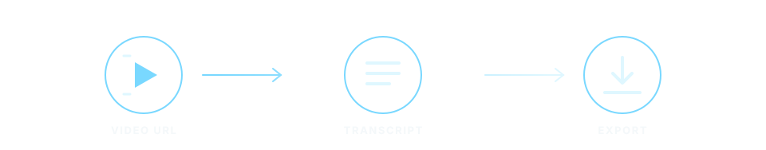

  

  <a href="https://wods.io"><strong>wods.io</strong></a>

Readable transcripts from supported video URLs.

  

<h2 align="center">Free web</h2>

<table align="center" width="100%">
  <tr>
    <td align="center" width="50%"><strong>Unlimited transcription</strong> Turn supported video URLs into readable text.</td>
    <td align="center" width="50%"><strong>AI fallback</strong> Keep going when captions are unavailable.</td>
  </tr>
  <tr>
    <td align="center"><strong>Searchable output</strong> Timestamped segments for quick navigation.</td>
    <td align="center"><strong>Flexible exports</strong> JSON, TXT, SRT, and VTT formats.</td>
  </tr>
</table>

<h2 align="center">Paid plans</h2>

<strong>Coming soon</strong>

Bulk and parallel transcription for thousands of videos with cost-efficient scaling.

