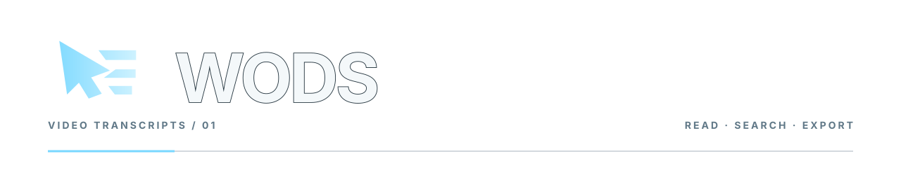
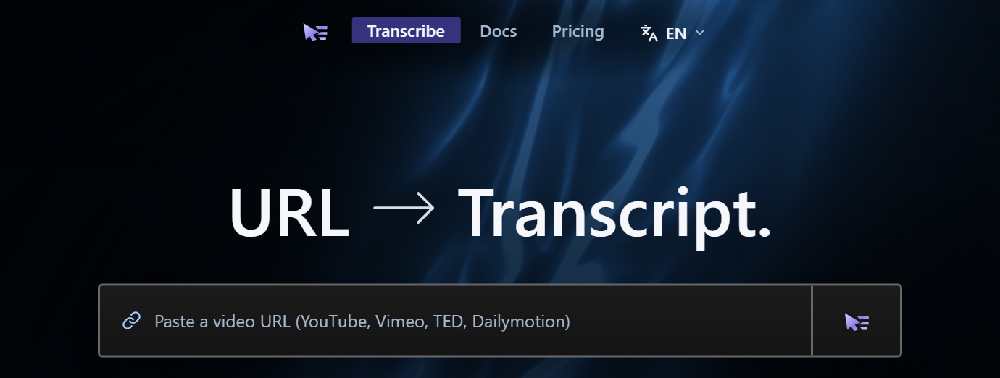

<picture>
  <source media="(prefers-color-scheme: dark)" srcset=".github/assets/wods-readme-header-dark.svg" />
  
</picture>

**Readable transcripts from supported video URLs.**

[wods.io](https://wods.io) · [Documentation](https://wods.io/docs)

<h3>
  <picture>
    <source media="(prefers-color-scheme: dark)" srcset=".github/assets/wods-free-dark.svg" />
    
  </picture>
</h3>

Unlimited free transcription, with AI fallback when captions are unavailable. Segmented, timestamped, searchable output. Export as JSON, TXT, SRT or VTT.

<h3>
  <picture>
    <source media="(prefers-color-scheme: dark)" srcset=".github/assets/wods-planned-dark.svg" />
    
  </picture>
</h3>

**Planned paid capabilities — not yet released.**

1,000,000 hours of video transcription and 50,000 hours of AI fallback transcription. Bulk and parallel processing for thousands of videos.

Playlist, channel and website transcription; channel auto-sync; AI-edited transcripts; searchable transcript archives.

API access and key management, automations and completion webhooks, and MCP server integration.
